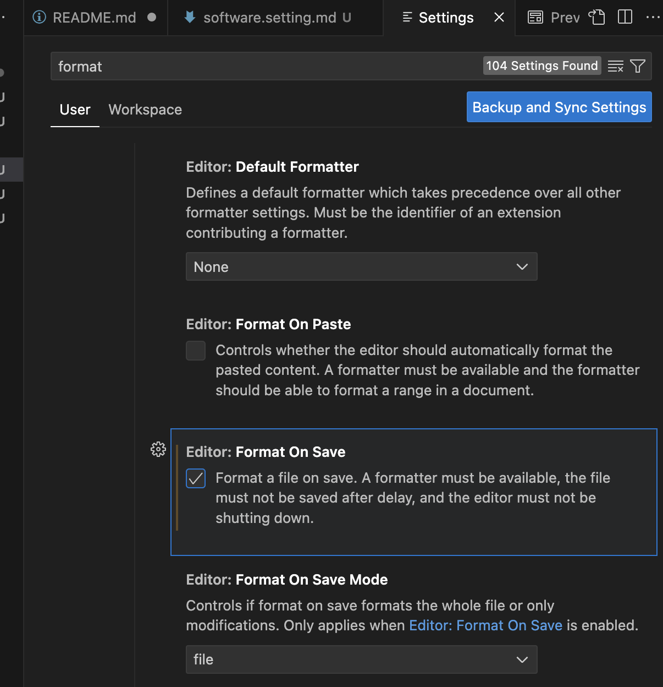
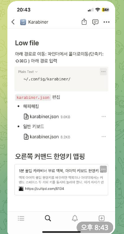

# 기본적인 Software Setting

- 1. <a href="https://www.google.com/chrome/?brand=CHBD&ds_kid=43700078579938377&gclid=CjwKCAiAhJWsBhAaEiwAmrNyq4iOQhjcQATafQJRJ9YeC9BqGXqGqrdJYNnGw4-sVxapmxTGdv2caRoC-YAQAvD_BwE&gclsrc=aw.ds"> chrome </a>
- 2. <a href="https://code.visualstudio.com/"> visual studio codes </a>

- 3.  mysql-workbench (mysql)
- 4. <a href="https://code.visualstudio.com/"> pgadmin </a> 
- 5. medis (redis)
- 6. <a href="https://fig.io/download"> fig </a>
- 7. <a href="https://spectacle.softonic.kr/mac"> spectacle </a>
- 8. <a href="https://karabiner-elements.pqrs.org/"> karabiner </a>
- 9. <a href="https://brew.sh/ko/"> brew </a>
- 10. <a href="https://iterm2.com/"> Iterms </a>

## In Visual Studio Code

- Format on Save

## Karabiner Mapping ***

- <a href="https://cultpd.com/6134">karabiner key setting</a>

## Iterms Setting

- <a href="https://medium.com/harrythegreat/oh-my-zsh-iterm2로-터미널을-더-강력하게-a105f2c01bec"> Iterms Setting Site </a>
